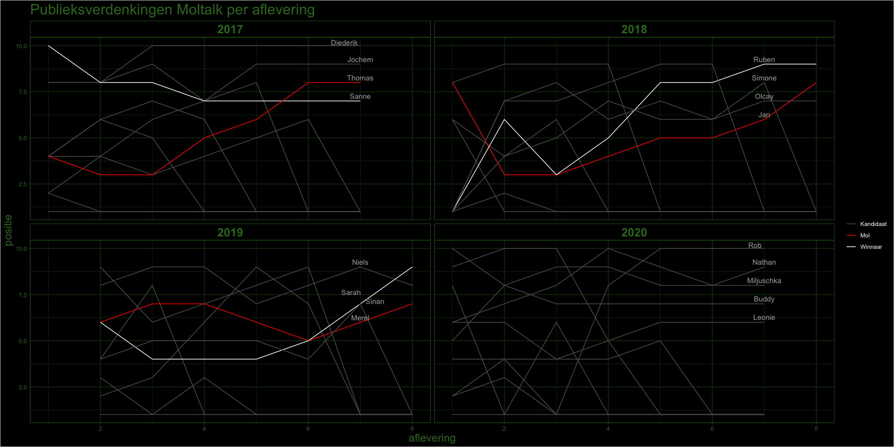

```{r setup, message = F, echo = F}
knitr::opts_chunk$set(echo = TRUE)

# packages
library(tidyverse)
library(ggrepel)
```


### Data

Aan het einde van elke Moltalk aflevering worden de publieksverdenkingen getoond. Het blijkt dat deze verdenkingen weinig te maken hebben met _Wisdom of the Crowd_ aangezien de mol jaarlijks tot op het laatste moment niet verdacht is. Dit betekent of heel goed molwerk of, veel waarschijnlijker, goed montagewerk zodat vooral kandidaten verdacht in beeld komen en de mol wat uit het zicht wordt gehouden. In 2019 mist de eerste meting omdat de crowd toen zo groot was dat Chris de cijfers niet kon tonen.

### Methode

De verdenkingen (in percentages) zijn omgezet naar _ranking_ waarbij alle posities van afvallers behouden blijven (nl verdenking = 0). Anders zou bij gelijke verdenking door afvallers een stijgende lijn te zien zijn terwijl de verdenking feitelijk constant bleef. 

Er is gebruik gemaakt van `R`, `tidyverse` en `ggrepel`, de laatste vanwege de overlap van Sarah en Sinan in aflevering 7.

```{r, message = F}
# dataset
widm <- read_csv('Moltalk verdenkingen.csv') %>%
  group_by(jaar) %>%
  replace(is.na(.), 0) %>%
  mutate(ra1 = min_rank(a1),
         ra2 = min_rank(a2),
         ra3 = min_rank(a3),
         ra4 = min_rank(a4),
         ra5 = min_rank(a5),
         ra6 = min_rank(a6),
         ra7 = min_rank(a7),
         ra8 = min_rank(a8)) %>%
  ungroup() %>%
  select(contains('ra'), naam, jaar) %>%
  mutate(ra8 = ifelse(jaar == 2020 | jaar == 2017, NA, ra8),
         ra1 = ifelse(jaar == 2019, NA, ra1)) %>%
  gather(key, val, -naam, -jaar) %>%
  mutate(aflevering = as.double(gsub('ra', '', key))) %>%
  rename(positie = val) %>%
  mutate(rol = ifelse(naam == 'Merel' | 
                      naam == 'Jan' | 
                      naam == 'Thomas',  'Mol', 
                      ifelse(naam == 'Sanne'| 
                             naam == 'Ruben'|
                             naam == 'Sarah', 'Winnaar', 'Kandidaat'))) 

# labels voor namen in de plot
labels <- widm %>%
   filter(aflevering == 7 & positie > 1)
```


Om het geheel wat op te leuken heb ik nog even een WIDM theme in elkaar gezet:

```{r}
# WIDM kleuren
widm_groen <- '#337820'
widm_groen_shade <- '#193c10'

# WIDM ggplot2 theme
widm_theme <- theme(plot.background = element_rect(fill = "black")) +
  theme(plot.title = element_text(size = rel(2), color = widm_groen)) +
  theme(axis.text = element_text(colour = widm_groen)) +
  theme(panel.background = element_rect(fill = 'black')) +
  theme(panel.grid.major = element_line(color = widm_groen_shade)) +
  theme(panel.grid.minor = element_line(color = widm_groen_shade)) +
  theme(panel.border = element_rect(color = widm_groen, fill = NA)) +
  theme(strip.background = element_rect(color = widm_groen, fill = 'black')) +
  theme(strip.text.x = element_text(colour = widm_groen, face = "bold", size = rel(2))) +
  theme(legend.background = element_rect(colour = 'black', fill = 'black')) +
  theme(legend.text = element_text(color = 'white')) +
  theme(legend.key  = element_rect(fill = 'black', colour = 'black')) +
  theme(axis.title.x = element_text(color = widm_groen, size = rel(1.5))) +
  theme(axis.title.y = element_text(color = widm_groen, size = rel(1.5))) +
  theme(axis.line = element_line(color = widm_groen_shade)) +
  theme(axis.title.y = element_text(color = widm_groen)) 
```


En dan het resultaat, wat er het beste uit ziet in full screen. Zie de WIDM.png in de repo

```{r, message = F, warning = F}
# plot
widm %>%
  ggplot(aes(aflevering, positie, group = naam, color = rol)) +
  geom_line() +
  facet_wrap(~jaar) +
  geom_text_repel(data = labels, 
              aes(label = naam), 
              color = 'grey68', 
              segment.colour = 'black', nudge_y = 0.2) +
  scale_color_manual(values = c('grey38', 'red', 'white')) +
  ggtitle('Publieksverdenkingen Moltalk per aflevering') +
  widm_theme
```


